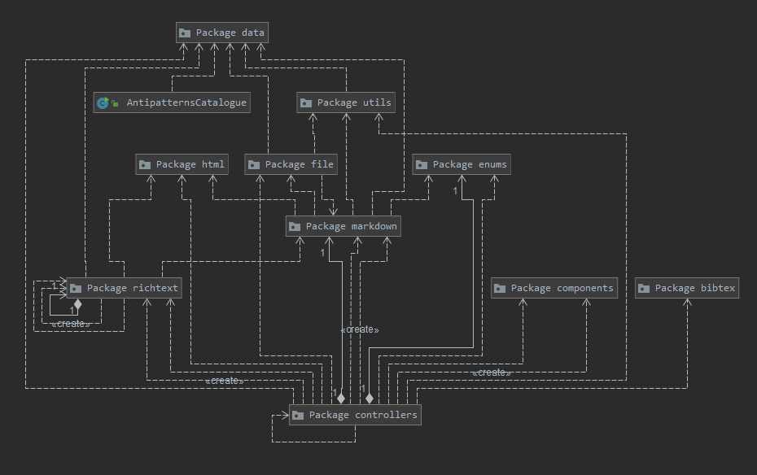
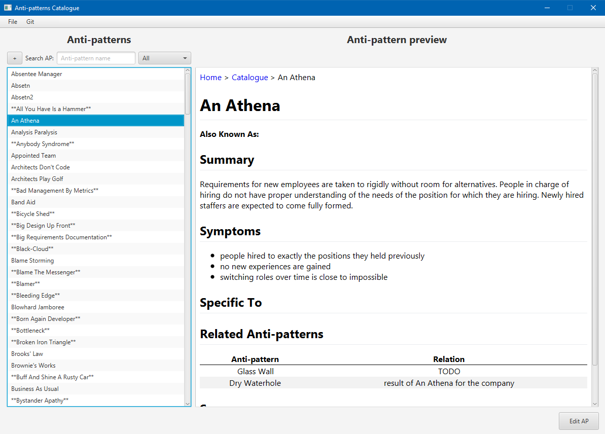
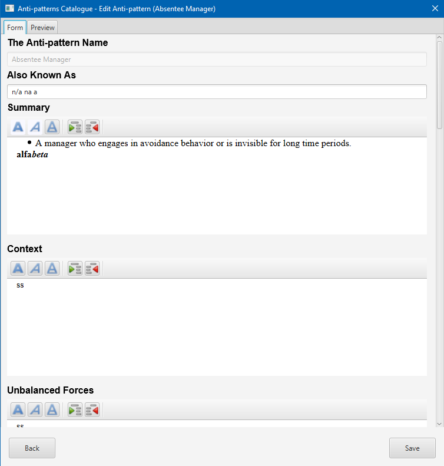
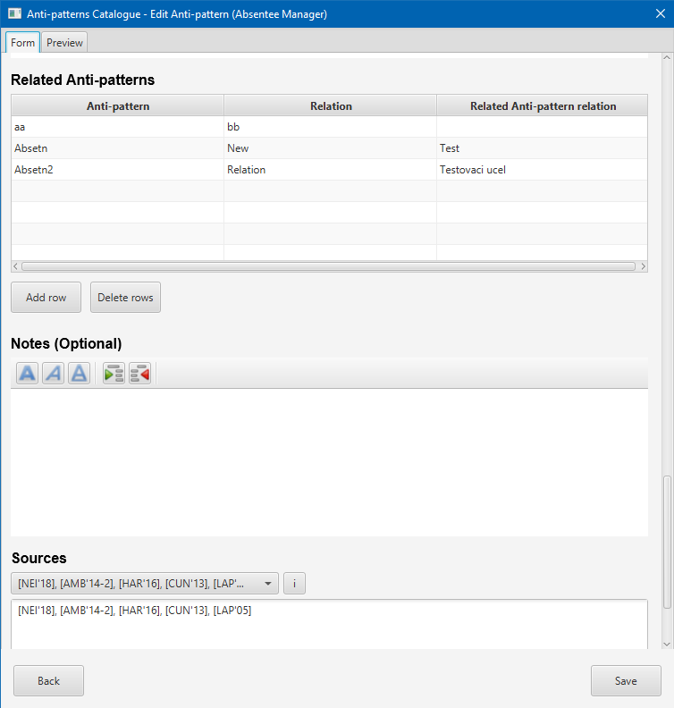
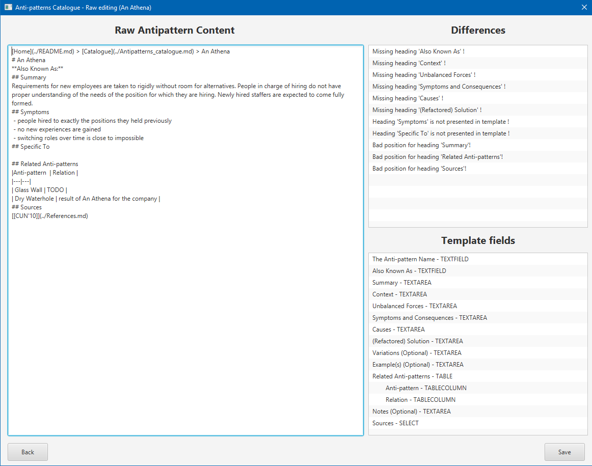
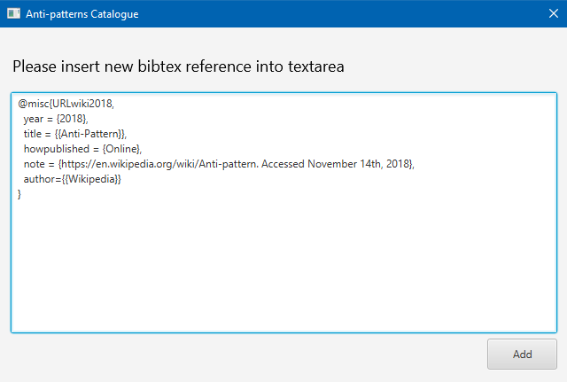
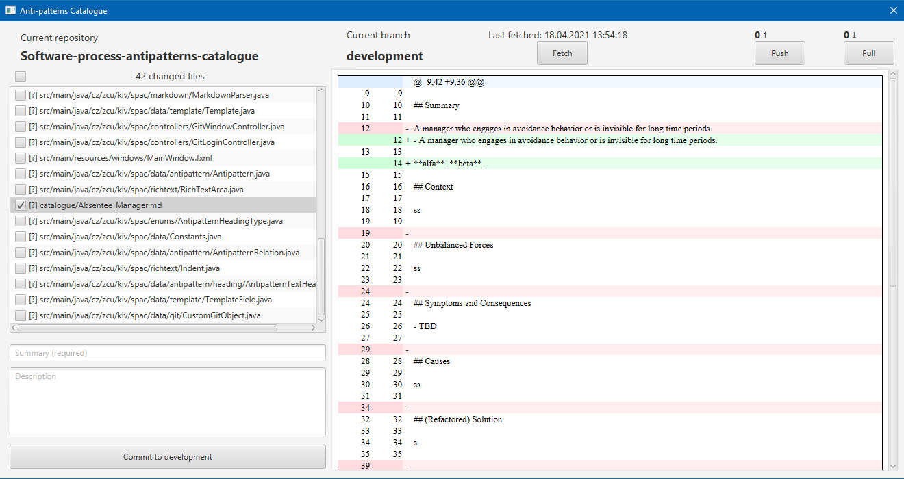

[Home](../../README.md) > Documentation

# Before start

This documentation is for and only this application, not for catalogue as such.

# Program documentation

In program documentation will be described some important functionality and proposals for the future.
Build steps are included too.

## Technologies

 - Java
 - JavaFX 11
 
## Packages

There are several packages:
 - *bibtex*: Classes for bibtex manipulating
 - *components*: Custom JavaFX components
 - *controllers*: Controllers for all windows
 - *data*: Data objects + defined constants
 - *enums*: Enumerations
 - *file*: Classes for manipulating with files
 - *html*: Classes for html manipulating
 - *markdown*: Classes for markdown manipulating
 - *richtext*: Rich textarea classes
 - *utils*: Variety utils method
 
 Package diagram:
 
 
## Used libraries

Used libraries in project:
 - *log4j* - Logging
 - *flexmark* - Markdown parser
 - *jgit* - Git logging
 - *slf4j* - Logger for jgit
 - *jbibtex* - Bibtex parser
 - *controlsfx* - Library contains additional javafx gui components

Licenses for all those libraries are writed in file **app/research_licenses.txt**.

## Build steps

For building application, you need Maven.

Run **app/build/build.bat**, which will build project and copy target jar to root folder.

## Git

## Proposals for the future

### Optimalization 

- Some windows are loading with not optimal speed.

### Running application

- Running script is quite hard-coded (probably) with all paths and --add-opens.

### Rich TextArea

 - Fix inserting image from code - can't load images manually, it only works via the button after creating rich textarea

### Existence check

 - In the case of AP, which is only an alias:
   - do not add both-side link
   - add link to referenced AP + use the name referenced in the table
   - the same with adding the name of the referrer to the hairy
   
### Reference

 - The current GUI for adding references to an anti-pattern is that there is a combobox with 
 shortcuts, and next to that, a button where all references are listed. It would be good if:
   - The combobox contained a caption and the author of the reference in addition to the abbreviation
   - After clicking on the reference in the combobox, only an abbreviation was added to the textarea - you will probably need to create your own combobox
   - When loading references to an anti-pattern, correctly pre-choose the listed references.
   
### Git

 1. Do push immediately after commit
 2. Automaticall fetch after some time
 3. Managing commit conflicts
 
### Table / Table columns
 - In current state, creating table columns are hard coded for specific number of columns (+ names).
 - Hints from Richard Lipka: 
    - Do your own value factory
    - AntipatternRelationTable.java -> instead of hardcoded attributes, create a hashmap<String,Property>

# User documentation

In User documentation will be described everything about input files and application functions (images included).
Run steps are included too

## System requirements

 - Java 11 and newer
 - Git
 
## Run steps

Files needed before starting application in **app** folder:
 - Antipatterns_catalogue.md
 - config.xml
 - git.properties - Set PAT, branch name and repository url
 - references.bib
 
Before you start your application first time, please run **app/ignore_gitproperties.bat** 
to disable **git.properties** file from updating to git. 

Run steps:
 1. Run **app/run.bat**  

## Configuration

Configuration file **config.xml** must be presented in the same directory as application.
It contains Anti-pattern form fields specification:
 - *name*: Name of field
 - *text*: Header text for field
 - *field*: Type of field (textarea / textfield / table / select)
 - *required*: true if field is required, false if optional
 - *default_value*: Default value in field
 - *placeholder*: Placeholder for field
 
If specific field is type table, it also contains specification for table columns:
 - *text*: Header text for column
 - *default_value*: Default value in column 

## Git properties

Git properties file **git.properties** must be presented in the same directory as application.
It contains git parameters for login into git repository.

There are 3 parameters:
 - *personalaccesstoken*: Personal Access Token (PAT) is required for login via git api.
 - *branch*: Branch name.
 - *repository*: Repository URL.
 
Important info - please execute **ignore_gitproperties.bat** file, so that **git.properties** 
will not be updated in git.

### How to generate PAT (Personal access token)

 1. Go to your profile settings
 2. Go to "Developer settings"
 3. Click on "Personal access tokens"
 4. Generate new token
 5. Authorize
 6. Write something in note
 7. In select scopes, select: **repo**, **user**
 8. Click on "Generate token"
 9. Copy generated token and save it to **git.properties** file. Make sure you saved it immediately, because token will be hidden for the rest of your life and cannot be shown in future.

## Application windows

### Main window

Main window mostly displays list of all anti-patterns and their preview. There is also a search field and 
choice box (show all anti-patterns, created or mentioned).

To create a new anti-pattern, just click on button with '+' next to search field. It will open new window (viz header _New / Edit anti-pattern window_).

To update existing anti-pattern, just double-click on specific anti-pattern. If selected anti-pattern have format different from template,
then it will open window with raw editing (viz header _New / Edit anti-pattern window_). If anti-pattern have format same as template, then it will open editing window (viz header _New / Edit anti-pattern window_).

Main window also contains 2 sub-menus: 
 - *File*:
    - *New anti-pattern*: It will open new window (viz header _New / Edit anti-pattern window_)
    - *Generate references*: It will generate markdown references from existing bibtex references
    - *Add reference*: It will open new window (viz header _Add bibtex reference window_)
    - *Existence check for anti-patterns*: Do a relation existence check between linked anti-patterns and tries to create both-side relation
    - *Exit*: Exits the application
 - *Git*:
    - *Info*: It will open message box with git informations (same informations as in *git.properties* file)
    - *Manage*: It will open new window (viz header _New / Edit anti-pattern window_)

### New / Edit anti-pattern window

This window is used for creating new anti-pattern or editing existing anti-pattern. It contains form with specific fields.
Field is not required if header name contains suffix *(Optional)*.

There are currently 4 types of fields in form:
 - Rich textarea: Most common field, it is classic textarea with text styles as **bold**, *italic*, <u>underline</u>
 and indent.
 - Textfield: Used only for anti-pattern name and alias.
 - Table: Used only for relations (if related anti-pattern exists, it will create both-side link)
 - Select: Used only for managing sources (references).

### Raw anti-pattern editing window

This window contains 3 important elements:
 - Textarea with content: Raw anti-pattern content
 - List of differences: List of differences between fields from anti-pattern and template fields
 - Template fields: Fields used in template (names + positions)
 
To successfully edit selected anti-pattern, it must contains all fields from template and they must be in specific order.  

### Add bibtex reference window

This window contains only one textarea, where user needs to insert new reference in bibtex format. After user inserts
new reference and click on Add button, it will add this reference to bibtex references file and generate new markdown references file.

### Git manage window

Git manage window is used for commiting anti-pattern changes to specified git repository and branch. You can also pull
new changes.

If personal access token from **git.properties** file is invalid, it will open login window to insert a valid personal access token.

Window contains list of changes and preview window, same as in github desktop application.

