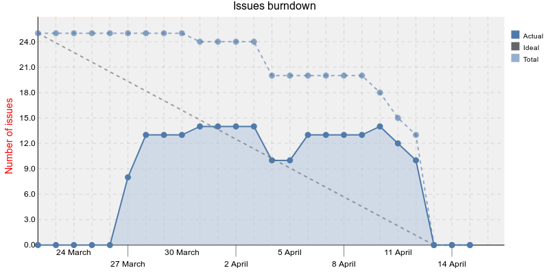

[Home](../README.md) > [Catalogue](../Antipatterns_catalogue.md) > Collective Procrastination
# Collective Procrastination
**Also Known As:**
## Summary
The team needs to handle several commitments in parallel, so it focuses on most pressing issues (from other commitments) until the iteration commitment becomes pressing, then rushes to finish off the iteration.  The bad consequence is that from the outside, actual status of work done is not known during the iteration which hinders planning and problem solving.

(Alternative cause with the same symptoms and consequences: Team wants reduce the administrative overhead of reporting time spent on tasks, so it delays reporting until it becomes a pressing issue. Additional bad consequence is that from the inside, the data reported does not correctly reflect reality.)

## Symptoms
 - rock-edge (one occurrence spanning the whole project) or staircase (repeated occurence usually coinciding with a meeting, milestone or release date) burndown
 - progress stalled for a time, then sudden increase
 - a dramatic and fast paced (quasi-immediate) burst of issues solved prefaced by a stagnation period
 
### Example

The anti-pattern occurs on 10-13th April.

## Specific To

## Related Anti-patterns
|Anti-pattern  | Relation |
|--|--|
| [Fire Drill](Fire_Drill.md) | specific cause of management spending to much time on pre-development activities |
## Sources
experience
